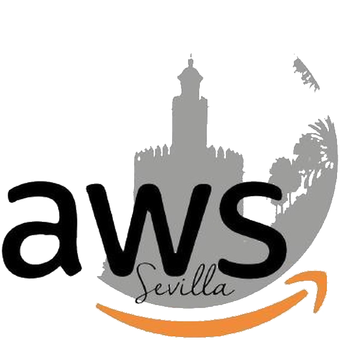

# aws-sevilla-aprende-aws-usando-terraform-01

Workshop sobre AWS y Terraform para iniciarse en el mundillo.

Impartido en AWS Sevilla.

## Qué haremos

En este workshop trabajaremos con VPCs, Subredes y EC2.

Crearemos una VPC principal con una subred que pondremos como pública.
En ella levantaremos una máquina EC2 con una web accesible solo por http (puerto 80).

## Diapositivas

Puedes ver las diapositivas usadas para el Workshop aquí: [aprende-aws-usando-terraform-01.pdf](./aprende-aws-usando-terraform-01.pdf)

## Requisitos mínimos

- Tener cuenta en AWS.
- Tener terraform instalado.

## Tareas

- 00 - Importación del provider
- 01 - Crear red
- 02 - Crear ruteo
- 03 - Crear instancia
- 04 - Destruir todos los recursos.
 
## Contacto

Ponente de la charla: [Rogelio Ramos](https://www.linkedin.com/in/rogelio-ramos/)

Organizadores del grupo AWS Sevilla:
- [Antonio Gerena](https://www.linkedin.com/in/antonio-gerena/)
- [Carmelo Zubeldia](https://www.linkedin.com/in/carmelo-zubeldia/)

Enlaces a AWS Sevilla:
- [Meetup](https://www.meetup.com/es-ES/AWS-Sevilla/)
- [LinkedIn](https://www.linkedin.com/company/aws-sevilla)
- [Github](https://github.com/awsSevilla)